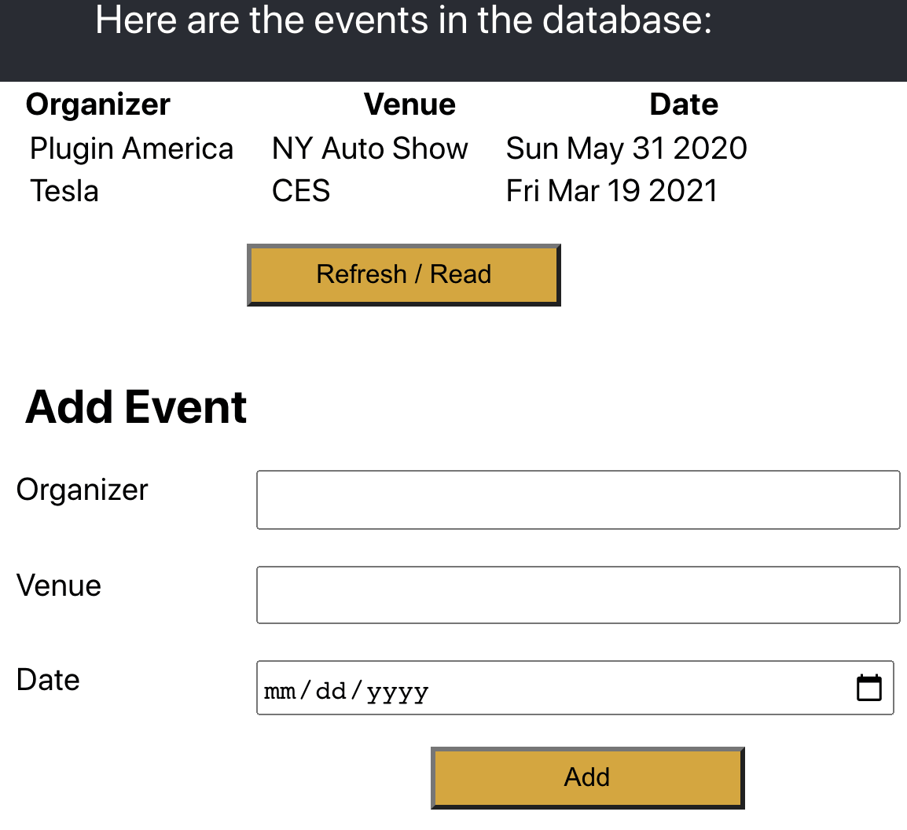

# Kickstart your AWS Lambda serverless project locally on Node.js
This is not a production server! Rather, this demo provides good
practices, while maintaining legible simplicity to get you coding.

Replace the local express server with your live AWS Lambda instance.



## Install
* Steps for Linux, Mac OSX & Cygwin. 
* Docker-machine should be installed & running
* Node v12 LTS is recommended, but works so far with v14

Repo passes `yarn check` for clean performance.
This should also allow `npm` or `pnpm` if you prefer.

cd *project root*
```bash
git clone https://github.com/lambci/docker-lambda.git
# cp env.example .env # edit .env if you understand it

bash get.sh example # check that docker-lambda works

cd server
```
You can also build your own database specified in `.env`
```bash
cp server/prisma/example.db server/prisma/dev.db
# Otherwise migrate your custom db
# yarn run db:create      # also calls populate.js
yarn run test
yarn start
cd ../client
yarn
cd ..                   # project root
yarn run test
yarn start
open http://localhost:3000/ # OSX; Linux: xdg-open. Auto-opens, anyway

bash lint.sh  # run this CI before deploying
```

## Design
* Code is intentionally minimal for you to read & extend it.
* Back-end uses Express to dispatch events to Lambda.

### Choices
Project | Application
------- | -----
Express | Popular server, simpler & more realistic than always-open Lambda port
Create-react-app | Popular JS client with tests & typescript
Typescript | Easier to move from Typescript to JS than vice-versa
React Functions | Better than classes, to fit reactive functional programming
Prisma | "not an ORM". Popular, tested, fast, flexible. It integrates Lambda, GraphQL, migrations & more
Ava | Provides high performance back-end unit tests

### Future Plans
* Add [graphql](https://www.prisma.io/docs/understand-prisma/prisma-in-your-stack/graphql#graphql-servers-under-the-hood) when Prisma integration improves or winner emerges
* Add [SASS](https://scotch.io/tutorials/using-sass-in-create-react-app-v2) when Tailwind or Create-react-app better supports SCSS

## Notes
This project uses [docker-lambda](https://github.com/lambci/docker-lambda) which
promises a faithful AWS Lambda. Less faithful, but lighter is 
[lambda-local](https://www.npmjs.com/package/lambda-local)

## See Also
* awesome aws lambda https://github.com/danteata/awesome-aws-lambda
* serverless app for nodejs, python, etc https://github.com/serverless/examples
* prisma https://github.com/Gomah/prisma-serverless
* [WarpJS](https://medium.com/warpjs/4-steps-to-add-a-serverless-back-end-to-react-ff2a6303727b)
is a commercial cross-cloud solution for AWS, Azure & GCP
* https://github.com/awnali/serverless-lambda-kickstarter
* https://github.com/awnali/lambda-api-kickstarter

## Known Bugs
Form POST may allow malformed input with a warning. Server still sanitizes before saving.
Solve this with a tested validation library, such as Formik or React Forms.
